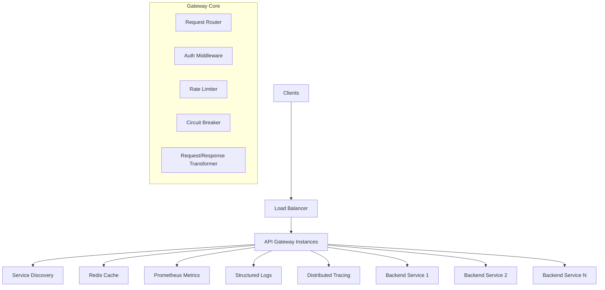

# API Gateway Design Document

## Overview

The Rust API Gateway is designed as a high-performance, cloud-native gateway that serves as a unified entry point for multiple communication protocols. Built with Rust's safety and performance guarantees, it leverages the async ecosystem centered around Tokio for handling concurrent connections efficiently.

The gateway follows a modular, plugin-based architecture that allows for extensibility while maintaining performance. It's designed to run as a containerized application in Kubernetes clusters with full observability and dynamic configuration capabilities.

## Architecture

### High-Level Architecture



### Core Components Architecture

The gateway is built around several core components that work together:

1. **Protocol Detection Layer**: Automatically identifies incoming protocol type
2. **Routing Engine**: Matches requests to appropriate backends using configurable rules
3. **Middleware Pipeline**: Processes requests through authentication, rate limiting, transformation, etc.
4. **Load Balancer**: Distributes requests across healthy backend instances
5. **Service Discovery**: Maintains real-time view of available services
6. **Configuration Manager**: Handles dynamic configuration updates
7. **Observability Stack**: Collects metrics, logs, and traces

## Components and Interfaces

### 1. Protocol Detection and Handling

```rust
// Core trait for protocol handlers
#[async_trait]
pub trait ProtocolHandler: Send + Sync {
    async fn can_handle(&self, request: &IncomingRequest) -> bool;
    async fn handle(&self, request: IncomingRequest, context: RequestContext) -> Result<Response, GatewayError>;
}

// Protocol-specific implementations
pub struct HttpHandler {
    router: Arc<HttpRouter>,
    middleware_chain: MiddlewareChain,
}

pub struct GrpcHandler {
    service_registry: Arc<GrpcServiceRegistry>,
    reflection_service: Option<ReflectionService>,
}

pub struct WebSocketHandler {
    connection_manager: Arc<WebSocketConnectionManager>,
    message_router: Arc<MessageRouter>,
}
```

**Design Rationale**: Using trait objects allows for dynamic dispatch while maintaining type safety. Each protocol handler encapsulates protocol-specific logic while sharing common interfaces.

### 2. Request Routing System

```rust
// Route matching with support for path parameters and wildcards
pub struct Route {
    pub path_pattern: PathPattern,
    pub methods: Vec<HttpMethod>,
    pub upstream: UpstreamConfig,
    pub middleware: Vec<MiddlewareConfig>,
}

pub struct PathPattern {
    segments: Vec<PathSegment>,
    has_wildcards: bool,
}

pub enum PathSegment {
    Static(String),
    Parameter(String),
    Wildcard,
}

// Router implementation using radix tree for O(log n) lookups
pub struct Router {
    routes: RadixTree<Route>,
    default_route: Option<Route>,
}
```

**Design Rationale**: Radix tree provides efficient route matching with O(log n) complexity. Path parameters and wildcards are parsed once during configuration loading.

### 3. Service Discovery Integration

```rust
#[async_trait]
pub trait ServiceDiscovery: Send + Sync {
    async fn discover_services(&self) -> Result<Vec<ServiceInstance>, DiscoveryError>;
    async fn register_service(&self, service: ServiceInstance) -> Result<(), DiscoveryError>;
    async fn watch_changes(&self) -> Result<ServiceChangeStream, DiscoveryError>;
}

// Kubernetes-native service discovery
pub struct KubernetesDiscovery {
    client: kube::Client,
    namespace: String,
}

// Consul integration
pub struct ConsulDiscovery {
    client: consul::Client,
    datacenter: String,
}

pub struct ServiceInstance {
    pub id: String,
    pub name: String,
    pub address: SocketAddr,
    pub metadata: HashMap<String, String>,
    pub health_status: HealthStatus,
    pub protocol: Protocol,
}
```

**Design Rationale**: Abstraction over service discovery allows supporting multiple backends (Kubernetes, Consul, etc.) while maintaining consistent interface.

### 4. Load Balancing Strategies

```rust
#[async_trait]
pub trait LoadBalancer: Send + Sync {
    async fn select_instance(&self, instances: &[ServiceInstance], request: &Request) -> Option<&ServiceInstance>;
}

pub struct RoundRobinBalancer {
    counter: AtomicUsize,
}

pub struct LeastConnectionsBalancer {
    connection_counts: DashMap<String, AtomicUsize>,
}

pub struct ConsistentHashBalancer {
    hash_ring: ConsistentHashRing,
}

pub struct WeightedBalancer {
    weights: HashMap<String, u32>,
    random: ThreadRng,
}
```

**Design Rationale**: Strategy pattern allows pluggable load balancing algorithms. DashMap provides thread-safe concurrent access to connection counts.

### 5. Authentication and Authorization

```rust
#[async_trait]
pub trait AuthProvider: Send + Sync {
    async fn authenticate(&self, request: &Request) -> Result<AuthContext, AuthError>;
    async fn authorize(&self, context: &AuthContext, resource: &str, action: &str) -> Result<bool, AuthError>;
}

pub struct JwtAuthProvider {
    validator: JwtValidator,
    key_store: Arc<JwkStore>,
}

pub struct ApiKeyAuthProvider {
    key_store: Arc<dyn KeyStore>,
    rate_limiter: Arc<RateLimiter>,
}

pub struct AuthContext {
    pub user_id: String,
    pub roles: Vec<String>,
    pub permissions: Vec<Permission>,
    pub metadata: HashMap<String, Value>,
}
```

**Design Rationale**: Pluggable authentication allows supporting multiple auth methods. AuthContext carries user information through the request pipeline.

### 6. Rate Limiting

```rust
pub struct RateLimiter {
    algorithms: HashMap<String, Box<dyn RateLimitAlgorithm>>,
    storage: Arc<dyn RateLimitStorage>,
}

#[async_trait]
pub trait RateLimitAlgorithm: Send + Sync {
    async fn is_allowed(&self, key: &str, limit: u32, window: Duration) -> Result<bool, RateLimitError>;
}

pub struct TokenBucketAlgorithm {
    buckets: DashMap<String, TokenBucket>,
}

pub struct SlidingWindowAlgorithm {
    windows: DashMap<String, SlidingWindow>,
}

// Storage backends for distributed rate limiting
#[async_trait]
pub trait RateLimitStorage: Send + Sync {
    async fn get_count(&self, key: &str) -> Result<u32, StorageError>;
    async fn increment(&self, key: &str, ttl: Duration) -> Result<u32, StorageError>;
}
```

**Design Rationale**: Pluggable algorithms and storage backends allow for both in-memory and distributed rate limiting scenarios.

### 7. Circuit Breaker Implementation

```rust
pub struct CircuitBreaker {
    state: Arc<Mutex<CircuitBreakerState>>,
    config: CircuitBreakerConfig,
    metrics: Arc<CircuitBreakerMetrics>,
}

#[derive(Debug, Clone)]
pub enum CircuitBreakerState {
    Closed { failure_count: u32 },
    Open { opened_at: Instant },
    HalfOpen { success_count: u32 },
}

pub struct CircuitBreakerConfig {
    pub failure_threshold: u32,
    pub timeout: Duration,
    pub success_threshold: u32,
}
```

**Design Rationale**: State machine pattern clearly models circuit breaker behavior. Metrics collection enables monitoring of circuit breaker effectiveness.

### 8. Configuration Management

```rust
#[derive(Debug, Clone, Deserialize)]
pub struct GatewayConfig {
    pub server: ServerConfig,
    pub routes: Vec<RouteConfig>,
    pub upstream: UpstreamConfig,
    pub middleware: MiddlewareConfig,
    pub observability: ObservabilityConfig,
}

pub struct ConfigManager {
    current_config: Arc<RwLock<GatewayConfig>>,
    watchers: Vec<Box<dyn ConfigWatcher>>,
    validators: Vec<Box<dyn ConfigValidator>>,
}

#[async_trait]
pub trait ConfigWatcher: Send + Sync {
    async fn watch(&self) -> Result<ConfigChangeStream, ConfigError>;
}

// Hot reload implementation
impl ConfigManager {
    pub async fn reload_config(&self, new_config: GatewayConfig) -> Result<(), ConfigError> {
        // Validate new configuration
        for validator in &self.validators {
            validator.validate(&new_config)?;
        }
        
        // Apply configuration atomically
        let mut config = self.current_config.write().await;
        *config = new_config;
        
        // Notify components of configuration change
        self.notify_config_change().await?;
        
        Ok(())
    }
}
```

**Design Rationale**: RwLock allows multiple readers with exclusive writer access. Configuration validation prevents invalid configurations from being applied.

## Data Models

### Core Request/Response Models

```rust
pub struct IncomingRequest {
    pub protocol: Protocol,
    pub method: String,
    pub path: String,
    pub headers: HeaderMap,
    pub body: Body,
    pub remote_addr: SocketAddr,
    pub timestamp: Instant,
}

pub struct RequestContext {
    pub request_id: String,
    pub trace_id: String,
    pub auth_context: Option<AuthContext>,
    pub route: Option<Route>,
    pub upstream_instances: Vec<ServiceInstance>,
    pub metadata: HashMap<String, Value>,
}

pub struct Response {
    pub status: StatusCode,
    pub headers: HeaderMap,
    pub body: Body,
    pub processing_time: Duration,
}
```

### Configuration Models

```rust
#[derive(Debug, Clone, Deserialize)]
pub struct RouteConfig {
    pub path: String,
    pub methods: Vec<String>,
    pub upstream: String,
    pub middleware: Vec<String>,
    pub timeout: Option<Duration>,
    pub retry_policy: Option<RetryPolicy>,
}

#[derive(Debug, Clone, Deserialize)]
pub struct UpstreamConfig {
    pub name: String,
    pub discovery: DiscoveryConfig,
    pub load_balancer: LoadBalancerConfig,
    pub health_check: HealthCheckConfig,
    pub circuit_breaker: Option<CircuitBreakerConfig>,
}
```

## Error Handling

### Comprehensive Error Types

```rust
#[derive(Debug, thiserror::Error)]
pub enum GatewayError {
    #[error("Configuration error: {0}")]
    Configuration(#[from] ConfigError),
    
    #[error("Authentication failed: {0}")]
    Authentication(#[from] AuthError),
    
    #[error("Rate limit exceeded")]
    RateLimitExceeded,
    
    #[error("Circuit breaker open")]
    CircuitBreakerOpen,
    
    #[error("Upstream service unavailable")]
    ServiceUnavailable,
    
    #[error("Request timeout")]
    Timeout,
    
    #[error("Internal server error: {0}")]
    Internal(#[from] Box<dyn std::error::Error + Send + Sync>),
}

// Error response mapping
impl From<GatewayError> for Response {
    fn from(error: GatewayError) -> Self {
        match error {
            GatewayError::Authentication(_) => Response::unauthorized(),
            GatewayError::RateLimitExceeded => Response::too_many_requests(),
            GatewayError::ServiceUnavailable => Response::service_unavailable(),
            GatewayError::Timeout => Response::gateway_timeout(),
            _ => Response::internal_server_error(),
        }
    }
}
```

**Design Rationale**: Structured error types enable proper HTTP status code mapping and detailed error reporting. The `thiserror` crate provides ergonomic error handling.

## Testing Strategy

### Unit Testing Approach

```rust
// Example test structure for core components
#[cfg(test)]
mod tests {
    use super::*;
    use tokio_test;
    
    #[tokio::test]
    async fn test_route_matching() {
        let router = Router::new();
        router.add_route("/api/users/{id}", HttpMethod::GET, upstream_config);
        
        let request = create_test_request("/api/users/123");
        let route = router.match_route(&request).await.unwrap();
        
        assert_eq!(route.path_params.get("id"), Some(&"123".to_string()));
    }
    
    #[tokio::test]
    async fn test_circuit_breaker_state_transitions() {
        let circuit_breaker = CircuitBreaker::new(CircuitBreakerConfig::default());
        
        // Test failure threshold
        for _ in 0..5 {
            circuit_breaker.record_failure().await;
        }
        
        assert!(matches!(circuit_breaker.state(), CircuitBreakerState::Open { .. }));
    }
}
```

### Integration Testing

```rust
// Integration tests with test containers
#[cfg(test)]
mod integration_tests {
    use testcontainers::*;
    
    #[tokio::test]
    async fn test_end_to_end_request_flow() {
        // Start test backend service
        let backend = start_test_backend().await;
        
        // Configure gateway with test backend
        let gateway = Gateway::new(test_config(&backend)).await;
        
        // Send test request
        let response = gateway.handle_request(test_request()).await;
        
        assert_eq!(response.status(), StatusCode::OK);
    }
}
```

### Performance Testing

```rust
// Benchmark critical paths
#[cfg(test)]
mod benchmarks {
    use criterion::{black_box, criterion_group, criterion_main, Criterion};
    
    fn benchmark_route_matching(c: &mut Criterion) {
        let router = setup_router_with_1000_routes();
        
        c.bench_function("route_matching", |b| {
            b.iter(|| {
                let request = create_random_request();
                black_box(router.match_route(&request))
            })
        });
    }
    
    criterion_group!(benches, benchmark_route_matching);
    criterion_main!(benches);
}
```

**Design Rationale**: Comprehensive testing strategy covers unit tests for individual components, integration tests for end-to-end flows, and performance benchmarks for critical paths.

## Container and Kubernetes Integration

### Dockerfile Design

```dockerfile
# Multi-stage build for optimal image size
FROM rust:1.75-slim as builder

WORKDIR /app
COPY Cargo.toml Cargo.lock ./
COPY src ./src

# Build with optimizations
RUN cargo build --release

FROM debian:bookworm-slim

# Install runtime dependencies
RUN apt-get update && apt-get install -y \
    ca-certificates \
    && rm -rf /var/lib/apt/lists/*

# Create non-root user
RUN useradd -r -s /bin/false gateway

COPY --from=builder /app/target/release/api-gateway /usr/local/bin/
COPY config/ /etc/gateway/

USER gateway
EXPOSE 8080 8443 9090

ENTRYPOINT ["/usr/local/bin/api-gateway"]
CMD ["--config", "/etc/gateway/config.yaml"]
```

### Kubernetes Deployment

```yaml
# Kubernetes deployment with proper resource management
apiVersion: apps/v1
kind: Deployment
metadata:
  name: api-gateway
spec:
  replicas: 3
  selector:
    matchLabels:
      app: api-gateway
  template:
    metadata:
      labels:
        app: api-gateway
    spec:
      containers:
      - name: gateway
        image: api-gateway:latest
        ports:
        - containerPort: 8080
          name: http
        - containerPort: 8443
          name: https
        - containerPort: 9090
          name: metrics
        resources:
          requests:
            memory: "256Mi"
            cpu: "250m"
          limits:
            memory: "512Mi"
            cpu: "500m"
        livenessProbe:
          httpGet:
            path: /health
            port: 8080
          initialDelaySeconds: 30
          periodSeconds: 10
        readinessProbe:
          httpGet:
            path: /ready
            port: 8080
          initialDelaySeconds: 5
          periodSeconds: 5
```

**Design Rationale**: Multi-stage Docker build minimizes image size. Kubernetes deployment includes proper resource limits, health checks, and security best practices.

## Performance Considerations

### Memory Management

- Use `Arc<T>` for shared immutable data to minimize clones
- Employ `DashMap` for concurrent data structures to avoid lock contention
- Implement connection pooling to reuse HTTP/gRPC connections
- Use streaming for large payloads to avoid memory spikes

### Concurrency Model

- Leverage Tokio's work-stealing scheduler for optimal CPU utilization
- Use bounded channels for backpressure management
- Implement graceful shutdown to handle in-flight requests
- Employ async/await throughout to maximize concurrency

### Caching Strategy

- Implement multi-level caching (in-memory + Redis)
- Use cache-aside pattern for configuration data
- Implement cache warming for frequently accessed data
- Provide cache invalidation mechanisms

This design provides a solid foundation for building a production-ready API gateway in Rust with all the requested features while maintaining performance, reliability, and extensibility.