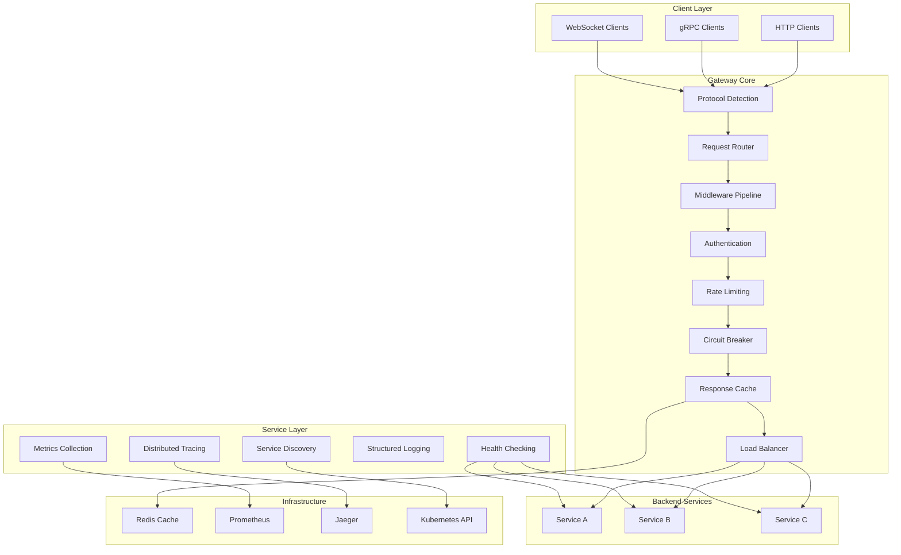
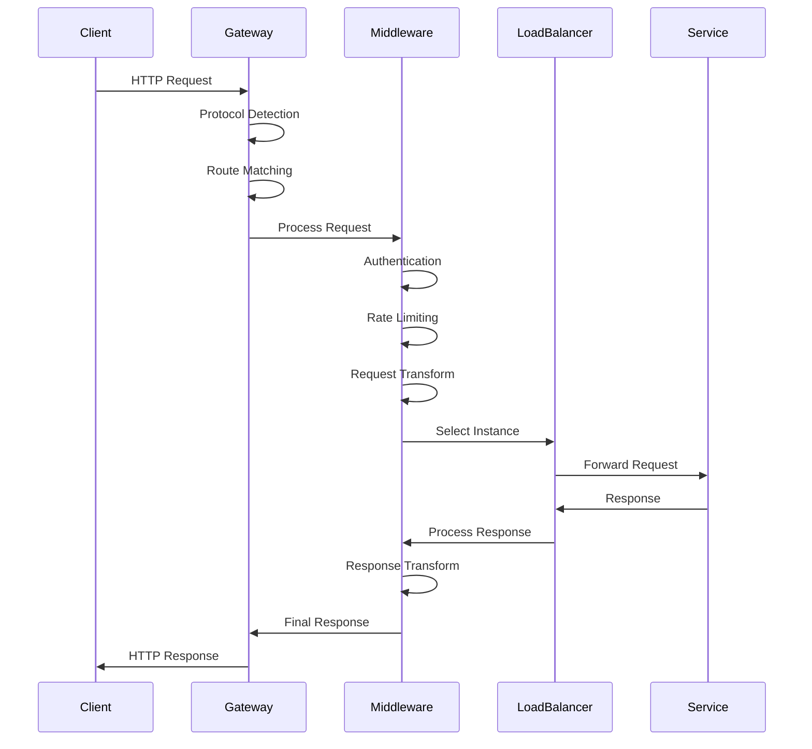
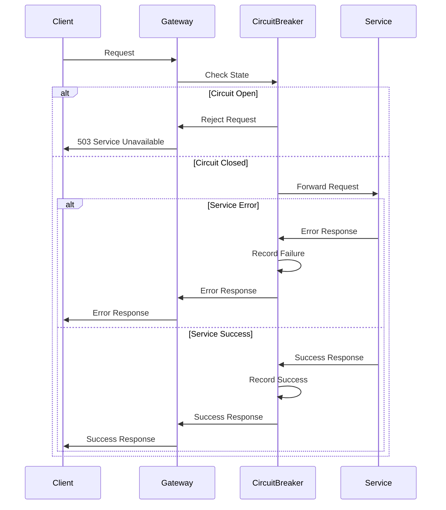
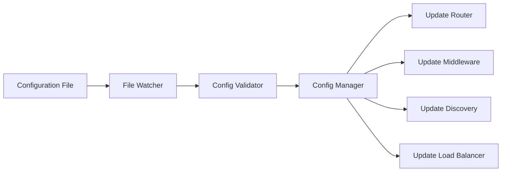
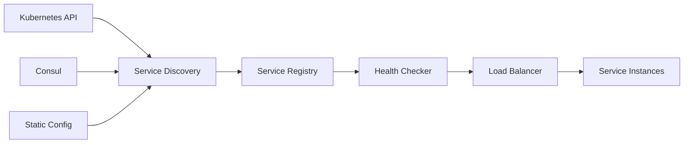

# Architecture Overview

This document provides a comprehensive overview of the Rust API Gateway's architecture, design decisions, and implementation patterns.

## Table of Contents

- [High-Level Architecture](#high-level-architecture)
- [Core Components](#core-components)
- [Request Flow](#request-flow)
- [Data Flow](#data-flow)
- [Concurrency Model](#concurrency-model)
- [Memory Management](#memory-management)
- [Performance Characteristics](#performance-characteristics)
- [Scalability Patterns](#scalability-patterns)
- [Security Architecture](#security-architecture)
- [Observability Design](#observability-design)

## High-Level Architecture

The Rust API Gateway follows a modular, event-driven architecture built on top of the Tokio async runtime. The design emphasizes performance, safety, and extensibility.



## Core Components

### 1. Protocol Detection Layer

**Purpose**: Automatically identify incoming protocol type and route to appropriate handler.

**Implementation**:
- Examines request headers and connection properties
- Supports HTTP/1.1, HTTP/2, gRPC, and WebSocket
- Zero-copy protocol detection where possible

**Key Files**:
- `src/protocols/mod.rs` - Protocol trait definitions
- `src/protocols/http.rs` - HTTP protocol handler
- `src/protocols/grpc.rs` - gRPC protocol handler
- `src/protocols/websocket.rs` - WebSocket protocol handler

### 2. Request Router

**Purpose**: Match incoming requests to configured routes and extract path parameters.

**Implementation**:
- Uses radix tree for O(log n) route matching
- Supports path parameters, wildcards, and regex patterns
- Compiled route patterns for optimal performance

**Key Features**:
- Path parameter extraction: `/users/{id}` → `{"id": "123"}`
- Wildcard matching: `/files/*` matches `/files/docs/readme.txt`
- Method-based routing with HTTP verb support
- Host-based routing for multi-tenant scenarios

### 3. Middleware Pipeline

**Purpose**: Process requests and responses through a configurable chain of middleware.

**Implementation**:
- Trait-based middleware system for extensibility
- Async middleware execution with proper error handling
- Configurable middleware ordering and conditional execution

**Built-in Middleware**:
- Authentication and authorization
- Rate limiting with multiple algorithms
- CORS handling
- Request/response transformation
- Compression (gzip, brotli)
- Request logging and tracing

### 4. Service Discovery

**Purpose**: Automatically discover and track available backend services.

**Implementation**:
- Pluggable discovery backends (Kubernetes, Consul, static)
- Real-time service change notifications
- Service metadata and health status tracking

**Discovery Backends**:
- **Kubernetes**: Uses Kubernetes API to watch services and endpoints
- **Consul**: Integrates with Consul service registry
- **Static**: Configuration-based service definitions
- **NATS**: NATS-based service announcements

### 5. Load Balancing

**Purpose**: Distribute requests across healthy service instances.

**Implementation**:
- Multiple load balancing algorithms
- Health-aware instance selection
- Connection pooling and reuse

**Algorithms**:
- **Round Robin**: Simple rotation through instances
- **Least Connections**: Route to instance with fewest active connections
- **Weighted**: Distribute based on configured weights
- **Consistent Hashing**: Session affinity using hash rings
- **Geographic**: Route based on client location

### 6. Health Checking

**Purpose**: Monitor service health and remove unhealthy instances from load balancing.

**Implementation**:
- Configurable health check intervals and timeouts
- Multiple health check types (HTTP, TCP, custom)
- Automatic instance removal and recovery

**Health Check Types**:
- **HTTP**: GET/POST requests to health endpoints
- **TCP**: Simple connection tests
- **gRPC**: gRPC health check protocol
- **Custom**: Plugin-based health checks

## Request Flow

### Typical Request Processing



### Error Handling Flow



## Data Flow

### Configuration Management



### Service Discovery Flow



## Concurrency Model

### Tokio Runtime Architecture

The gateway uses Tokio's multi-threaded runtime for handling concurrent requests:

```rust
// Runtime configuration
#[tokio::main]
async fn main() {
    // Tokio automatically configures worker threads based on CPU cores
    // Each worker thread runs an event loop
    // Tasks are work-stealing across threads
}
```

### Async Task Management

- **Request Handling**: Each request is processed as an async task
- **Background Tasks**: Health checking, metrics collection, config watching
- **Task Spawning**: New tasks for independent operations
- **Graceful Shutdown**: Coordinated shutdown of all tasks

### Shared State Management

```rust
// Shared state using Arc (Atomic Reference Counting)
struct GatewayState {
    config: Arc<RwLock<GatewayConfig>>,
    services: Arc<DashMap<String, ServiceInstance>>,
    metrics: Arc<MetricsCollector>,
}

// Thread-safe concurrent access
let services = state.services.clone(); // Cheap clone of Arc
tokio::spawn(async move {
    // Use services in background task
});
```

## Memory Management

### Zero-Copy Operations

The gateway minimizes memory allocations through zero-copy techniques:

- **Request Bodies**: Stream processing without full buffering
- **Response Forwarding**: Direct streaming from upstream to client
- **Header Processing**: In-place header manipulation where possible

### Memory Pool Usage

```rust
// Connection pooling to reuse HTTP connections
struct ConnectionPool {
    pools: DashMap<String, Pool<Connection>>,
}

// Buffer reuse for request/response processing
struct BufferPool {
    buffers: Arc<Mutex<Vec<BytesMut>>>,
}
```

### Garbage Collection Avoidance

- **Stack Allocation**: Prefer stack-allocated data structures
- **Arena Allocation**: Use memory arenas for temporary allocations
- **Reference Counting**: Arc/Rc for shared ownership without GC
- **RAII**: Automatic cleanup when values go out of scope

## Performance Characteristics

### Latency Optimization

- **Hot Path Optimization**: Critical paths are optimized for minimal latency
- **Async I/O**: Non-blocking I/O prevents thread blocking
- **Connection Reuse**: HTTP/2 and connection pooling reduce connection overhead
- **Efficient Data Structures**: Radix trees, hash maps, and lock-free structures

### Throughput Maximization

- **Work Stealing**: Tokio's work-stealing scheduler maximizes CPU utilization
- **Batch Processing**: Batch operations where possible (metrics, logging)
- **Pipeline Parallelism**: Concurrent processing of request pipeline stages
- **Resource Pooling**: Reuse expensive resources (connections, buffers)

### Memory Efficiency

- **Minimal Allocations**: Reduce heap allocations in hot paths
- **Streaming**: Process large payloads without full buffering
- **Compression**: Reduce memory usage for cached responses
- **Lazy Loading**: Load resources only when needed

## Scalability Patterns

### Horizontal Scaling

- **Stateless Design**: Gateway instances are stateless and can be scaled horizontally
- **Load Balancer Integration**: Works with external load balancers (nginx, HAProxy)
- **Service Mesh**: Integrates with service mesh for advanced traffic management

### Vertical Scaling

- **Multi-threading**: Utilizes all available CPU cores
- **Memory Scaling**: Efficient memory usage allows handling more concurrent connections
- **I/O Scaling**: Async I/O scales to thousands of concurrent connections

### Auto-scaling Integration

```yaml
# Kubernetes HPA configuration
apiVersion: autoscaling/v2
kind: HorizontalPodAutoscaler
metadata:
  name: api-gateway-hpa
spec:
  scaleTargetRef:
    apiVersion: apps/v1
    kind: Deployment
    name: api-gateway
  minReplicas: 3
  maxReplicas: 20
  metrics:
  - type: Resource
    resource:
      name: cpu
      target:
        type: Utilization
        averageUtilization: 70
```

## Security Architecture

### Defense in Depth

1. **Network Security**: TLS encryption, network policies
2. **Authentication**: Multiple auth providers, token validation
3. **Authorization**: RBAC, fine-grained permissions
4. **Input Validation**: Request validation, sanitization
5. **Rate Limiting**: DDoS protection, abuse prevention

### Security Headers

```rust
// Automatic security header injection
fn add_security_headers(response: &mut Response) {
    response.headers.insert("X-Content-Type-Options", "nosniff");
    response.headers.insert("X-Frame-Options", "DENY");
    response.headers.insert("X-XSS-Protection", "1; mode=block");
    response.headers.insert("Strict-Transport-Security", "max-age=31536000");
}
```

### Audit Logging

- **Security Events**: Authentication failures, authorization denials
- **Admin Operations**: Configuration changes, user management
- **Suspicious Activity**: Rate limit violations, unusual patterns
- **Compliance**: Structured logs for compliance requirements

## Observability Design

### Three Pillars of Observability

#### 1. Metrics
- **Request Metrics**: Rate, latency, error rate
- **System Metrics**: CPU, memory, connections
- **Business Metrics**: Custom application metrics
- **SLA Metrics**: Availability, performance targets

#### 2. Logging
- **Structured Logging**: JSON format with consistent fields
- **Correlation IDs**: Track requests across services
- **Log Levels**: Configurable verbosity
- **Log Aggregation**: Integration with ELK, Splunk, etc.

#### 3. Tracing
- **Distributed Tracing**: OpenTelemetry integration
- **Span Creation**: Automatic span creation for operations
- **Context Propagation**: Trace context across service boundaries
- **Performance Analysis**: Identify bottlenecks and slow operations

### Monitoring Integration

```rust
// Metrics collection example
use metrics::{counter, histogram, gauge};

// Request metrics
counter!("gateway_requests_total", 1, "method" => method, "status" => status);
histogram!("gateway_request_duration", duration, "service" => service);
gauge!("gateway_active_connections", active_connections as f64);
```

### Alerting Strategy

- **SLI/SLO Based**: Alert on SLO violations
- **Anomaly Detection**: Detect unusual patterns
- **Escalation**: Multi-level alerting with escalation
- **Runbook Integration**: Link alerts to troubleshooting guides

This architecture provides a solid foundation for a production-ready API gateway that can handle high traffic loads while maintaining reliability, security, and observability.